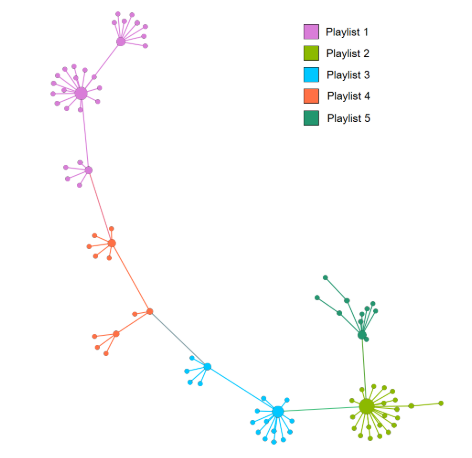

# Recomendação de Playlists no Spotify

 

  <a href="#Contextualização"> · <strong>Contextualização</strong></a> ·
  <a href="#Objetivo"><strong>Objetivo</strong></a> ·
  <a href="#Modelagem"><strong>Modelagem</strong></a> ·
  <a href="#Metodologia"><strong>Modelagem</strong></a> ·
  <a href="#Execução"><strong>Execução</strong></a> ·
  <a href="#Grafo"><strong>Grafo</strong></a> ·
  <a href="#Playlists"><strong>Playlists</strong></a> ·

 

## Contextualização

O [Spotify](https://www.spotify.com) forneceu a base de dados **The Million Playlist Dataset (MPD)** que contém 1.000.000 de playlists 
criadas por usuários do mesmo. Essa base foi criada para a realização de um desafio, o [RecSys Challenge](http://www.recsyschallenge.com/2018/),
o qual tem como objetivo ajudar usuários do Spotify a criar novas ou estenderem suas playlists. Como isso acontece? A empresa convida
pessoas da comunidade a utilizar a base de dados da forma que bem entenderem para alcançar o objetivo. Diante disso, decidimos aceitar o desafio.

## Objetivo

Dada a base de dados do Spotify, nosso objetio é gerar playlists inéditas, nas quais, as músicas pertencentes possuam grande afinidade
entre si.

## Modelagem

Para a resolução de nosso desafio, modelamos o nosso problema em um grafo, no qual os vértices representarão as músicas, e as arestas
representarão uma conexão entre duas músicas. Caso exista uma playlist que contenha duas músicas **X** e **Y**, existirá uma aresta
conectando-as. Além disso, nosso grafo é ponderado, sendo o peso definido pela quantidade de playlists que contém as músicas **X** e
**Y**, ou seja, caso existam 10 playlists que possuam dentre as suas músicas, as duas músicas **X** e **Y**, significa que o peso da
aresta entre as duas é **10**.  
Inicialmente, decidimos restringir os dados para facilitar a interpretação e representação do grafo a ser analisado. Nesse sentido, foi 
utilizado uma base de dados simplificada, contando com 1.000 playlists, também oferecida pelo Spotify. Assim como, foram retiradas todas
as músicas que apareceram menos de 100 vezes nas 1.000 de playlists. Ademais, após a geração do grafo, vértices com pouco peso (inferior
a 10), também foram removidas.  
Nesse sentido, o grafo bruto contém 37.583 músicas e 300.729 conexões (não agrupadas por peso, ou seja, caso existam 10 playlists contendo
músicas X e Y, haverá 10 arestas, cada uma com peso 1, ligando as músicas) entre músicas. Porém, de todas essas músicas, apenas 92
apareciam em mais de 100 playlists, e de todas as conexões, apenas 6.018 (não agrupadas por peso) tinham peso superior a 10, ou seja, 
são conexões entre duas músicas que compartilham mais de 10 playlists.  
Com o agrupamento por peso das arestas, o grafo ficou composto pelos mesmos 92 vértices, porém, com uma redução considerável na quantidade
de arestas, indo de 6.018 para 357.

## Metodologia

A partir da base de dados de playlists, precisaremos extrair  componentes conectados, que no contexto do problema, representarão novas
playlists. Para tal, utilizaremos o conceito de Detecção de Comunidades, o qual utiliza um algoritmo para encontrar a **Maximum Spanning
Tree**.  
Tradicionalmente, o algoritmo de Minimum Spanning Tree (MST) encontra uma árvore de cobertura, ou seja, um subgrafo que contém todos os
vértices do grafo original e é uma árvore, porém, mais especificamente, o MST encontra a árvore de cobertura que tem custo mínimo, de
acordo com o peso das arestas. Contudo, para o nosso problema, o objetivo é encontrar a árvore de cobertura máxima, pois essa irá conter
apenas as arestas de maiores pesos entre suas músicas, ou seja, as músicas mais relacionadas entre si. Diante disso, utilizaremos o
algoritmo **Kruskal**, utilizado na MST, modificado, removendo sempre a aresta de menor peso por vez até obtermos a MST.

## Execução

Para executar o código, é necerssário ter o [NodeJS](https://nodejs.org/en/) e o [NPM](https://www.npmjs.com/) instalados em seu computador.  
Posteriormente executar os seguintes comandos.

1. `npm install file-system`
1. `npm install underscore`
1. `npm install csv-stringify`

Por fim, para executar o programa, basta apenas executar `node gerarPlayists.js` e será gerada a MST e inserida em `mstEdges.csv`.

## Grafo

Nós utilizamos a ferramenta [Gephi](https://gephi.org/), na qual escolhemos o layout **Yifan Hu**, pois o mesmo é utilizado para representar
comunidades. O layout utiliza dois algoritmos, um deles gera as comunidades, aproximando os nós mais conectados, enquanto o outro,
chamado de **Barnes-Hut**, define o espaçamento entre as comunidades geradas. O Barnes-Hut considera as comunidades como sendo um
super-nó, então no nosso caso, que foram geradas 5 comunidades, o algoritmo “enxerga” 5 super-nós e os afasta baseado nas propriedades dos mesmos.
Executando o algoritmo de Detecção de Comunidades, obtivemos, como esperado, um grafo com a mesma quantidade de vértices, porém, com uma
quantidade reduzida de arestas. Pois, da definição de Árvore de Cobertura, temos que o número de arestas deve ser exatamente o número de
vértices decrementado de uma unidade. Ou seja, o grafo anteriormente possuía 357 arestas, as quais já haviam sido reduzidas de 6.018,
agora o mesmo possui apenas 91 arestas.  

  </a>

## Playlists

### PLAYLIST 1
1. We Are Young (feat. Janelle Monáe) - feat. Janelle Monáe
2. Feel So Close - Radio Edit
3. Wild Ones (feat. Sia)
4. We Are Never Ever Getting Back Together
5. Turn Me On (feat. Nicki Minaj) - feat. Nicki Minaj
6. Boyfriend
7. Levels - Radio Edit
8. Payphone
9. Don't Wake Me Up
10. Titanium (feat. Sia) - (feat. Sia)
11. Where Have You Been
12. Somebody That I Used To Know
13. Lights - Single Version
14. Party Rock Anthem
15. We Found Love
16. Sexy And I Know It
17. Little Lion Man
18. What Makes You Beautiful
19. Glad You Came
20. Drive By
21. Call Me Maybe
22. Midnight City
23. Starships
24. Rolling In The Deep
25. Gangnam Style
26. Pumped Up Kicks
17. Some Nights
28. I Won't Give Up
29. Good Time

### PLAYLIST 2
1. Mercy
1. Work Hard Play Hard
1. Don't You Worry Child (Radio Edit) [feat. John Martin]
1. Love Me
1. Swimming Pools (Drank)
1. The Motto
1. Take Care
1. Die Young
1. One More Night
1. I Cry
1. Scream & Shout
1. Whistle
1. Harlem Shake
1. Suit & Tie
1. Forever
1. Locked Out Of Heaven
1. Diamonds
1. Started From The Bottom
1. Young, Wild & Free (feat. Bruno Mars) - feat. Bruno Mars
1. Ni**as In Paris
1. Dance (A$$) Remix
1. Thrift Shop (feat. Wanz)

### PLAYLIST 3

1. On Top Of The World
1. Tongue Tied
1. It's Time
1. Take a Walk
1. The A Team
1. Too Close
1. Madness
1. Girl On Fire
1. The Way
1. Wagon Wheel
1. Daylight
1. I Will Wait
1. When I Was Your Man
1. Sail
1. Sweet Nothing
1. Radioactive
1. Cruise
1. Heart Attack

### PLAYLIST 4

1. Paradise
1. Eletric Feel
1. The Cave
1. Animal
1. Carry On
1. Home
1. Ho Hey
1. Hall of Fame
1. Little Talks
1. Stubborn Love
1. Anything Could Happen
1. Everybody Talks

### PLAYLIST 5

1. Can't Hold Us - feat. Ray Dalton
1. Get Lucky - Radio Edit
1. Mirrors
1. The Other Side
1. Just Give Me a Reason
1. Feel This Moment
1. My Songs Know What You Did In The Dark (Light Em Up)
1. Blurred Lines
1. I Love It (feat. Charli XCX) - feat. Charli XCX [Original Version]
1. Get Lucky
1. 22  
